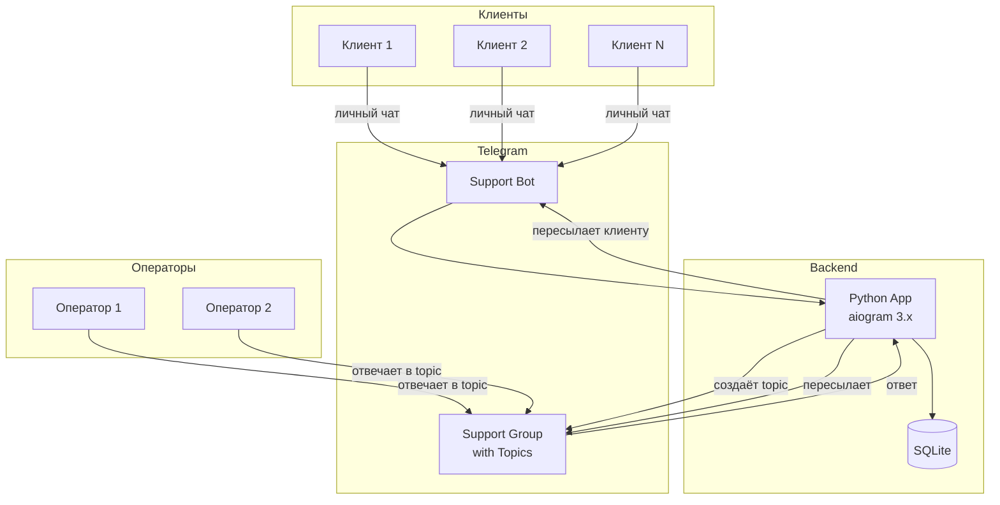
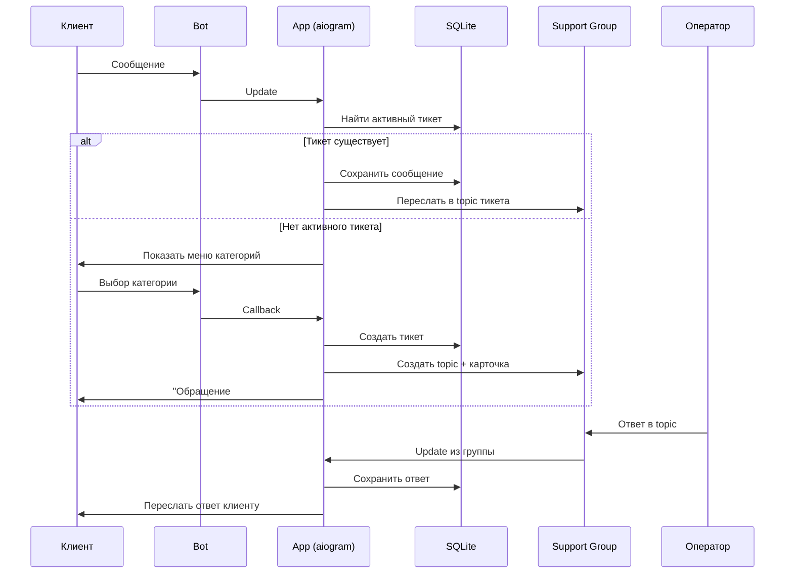
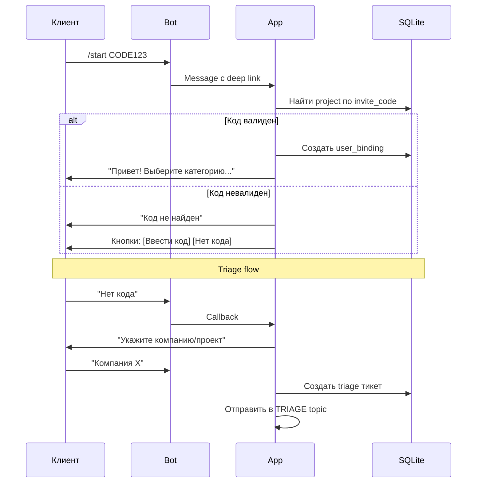
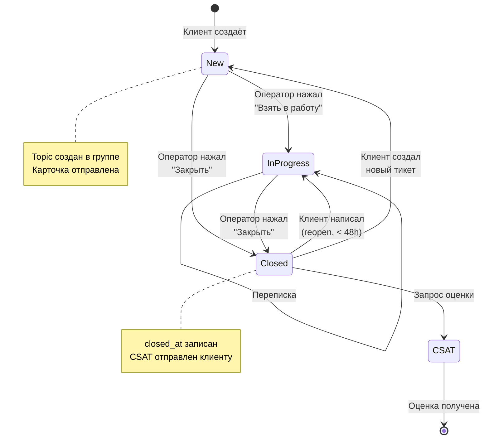
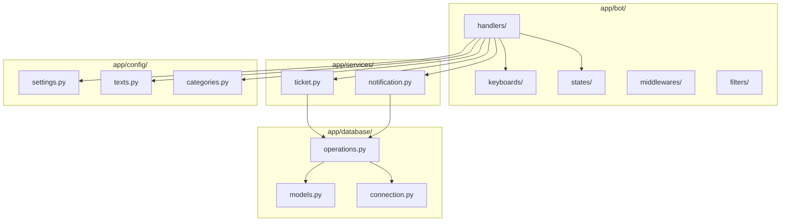
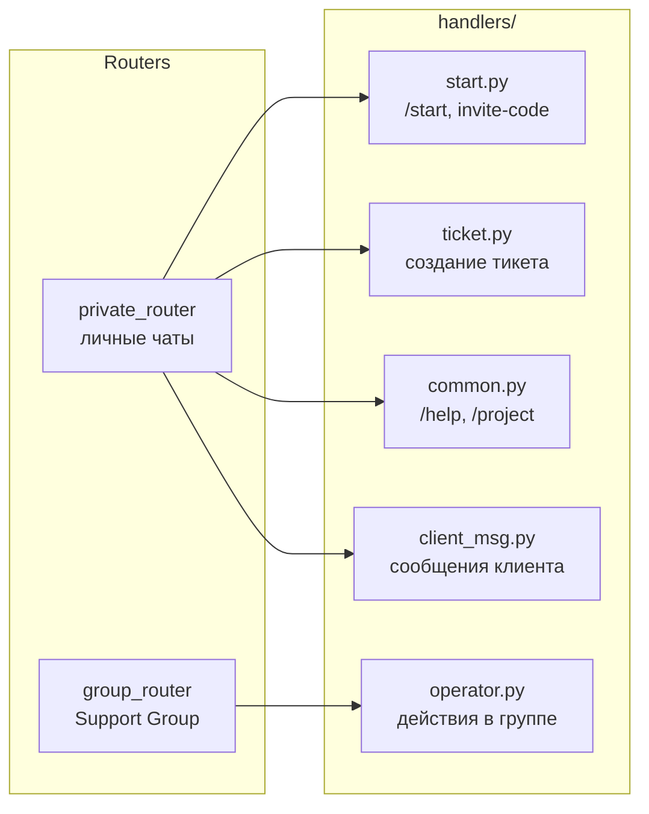
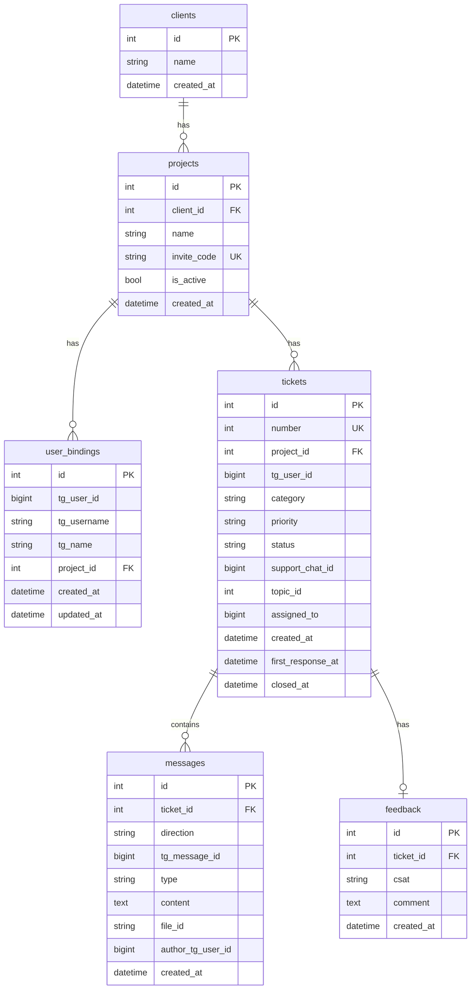
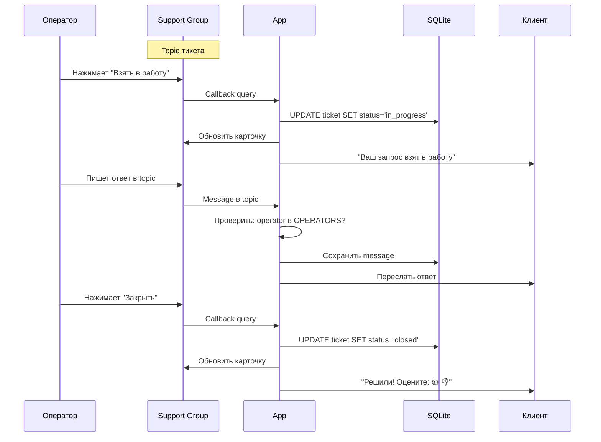

# Архитектура: Telegram Support Bot

## Общая схема системы

## Схема обработки сообщения клиента

## Идентификация через invite-code

## Жизненный цикл тикета

## Структура компонентов

## Handlers структура

## Схема базы данных

## Flow обработки в группе

---

*Диаграммы отображаются в GitHub/GitLab и в VS Code с расширением Mermaid.*
