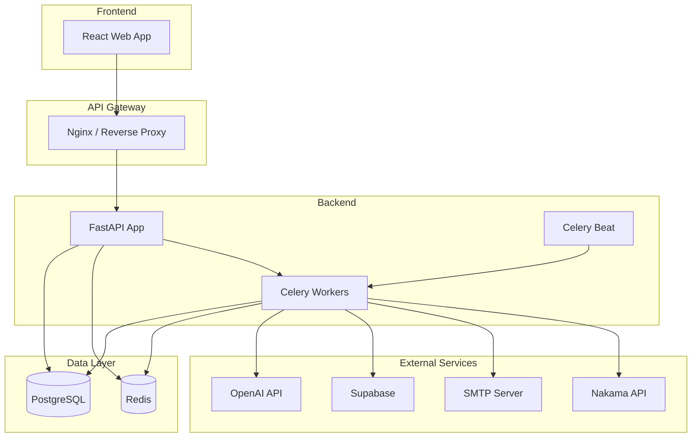
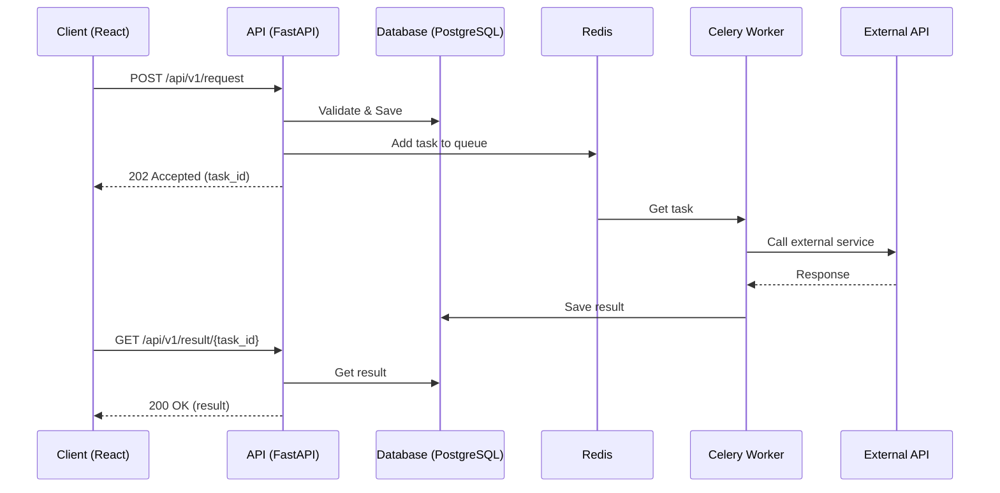
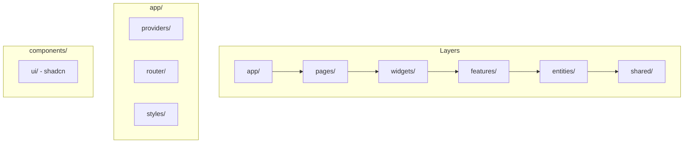
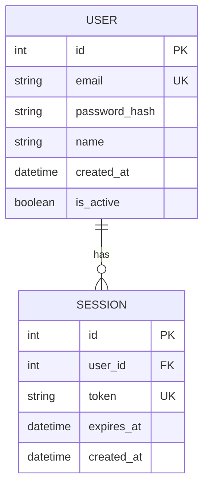
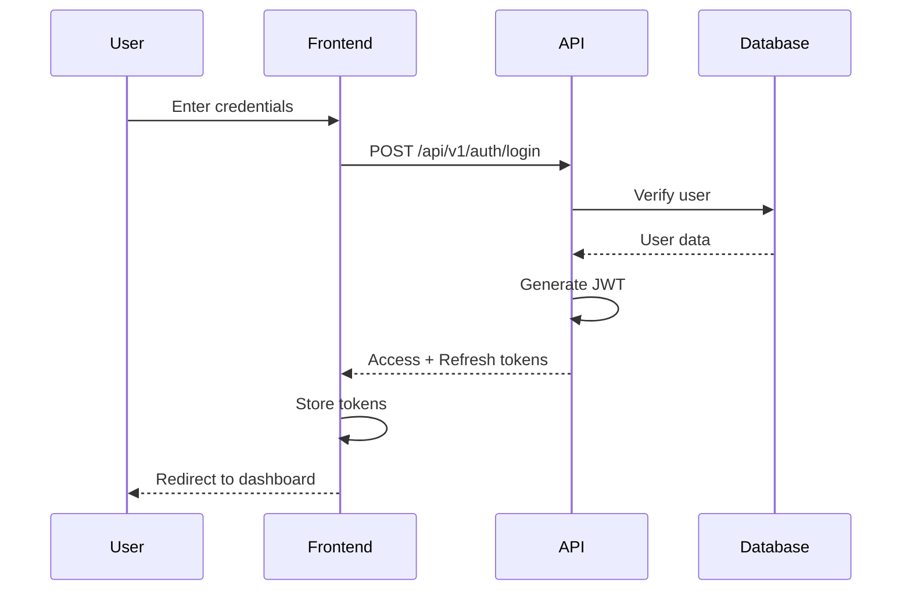
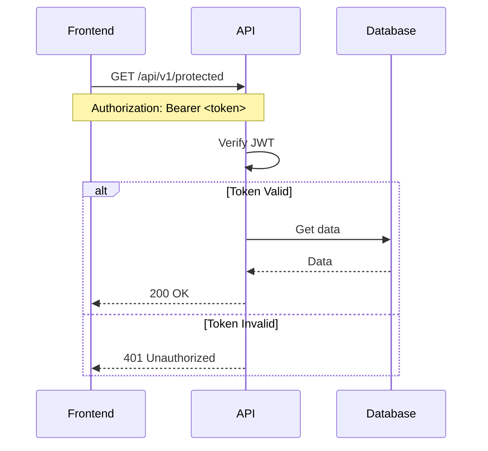

# Архитектура проекта: Customer Support

## Общая схема системы



## Схема обработки запроса



## Структура Frontend (Feature-Sliced Design)



## Компоненты системы

### Backend

| Компонент | Технология | Назначение |
|-----------|------------|------------|
| API Server | FastAPI | REST API endpoints |
| ORM | SQLAlchemy 2.0 | Database access |
| Validation | Pydantic | Data validation |
| Auth | python-jose | JWT tokens |
| Background | Celery | Async tasks |
| Cache | Redis | Caching & queue |

### Frontend

| Компонент | Технология | Назначение |
|-----------|------------|------------|
| UI Library | React 18 | UI rendering |
| State | TanStack Query | Server state |
| Routing | React Router | Navigation |
| Styling | Tailwind CSS | Styling |
| Components | shadcn/ui | UI components |
| Forms | react-hook-form | Form handling |
| Validation | Zod | Schema validation |

### Infrastructure

| Компонент | Технология | Назначение |
|-----------|------------|------------|
| Container | Docker | Containerization |
| Orchestration | Docker Compose | Multi-container |
| Proxy | Nginx | Reverse proxy |
| Database | PostgreSQL 16 | Primary database |
| Cache | Redis 7 | Cache & queue |

## Схема базы данных (пример)



## Потоки данных

### Аутентификация



### Protected Request



---

## Deployment

### Development

```
localhost:5173  → Frontend (Vite)
localhost:8000  → Backend (FastAPI)
localhost:5432  → PostgreSQL
localhost:6379  → Redis
```

### Production

```
example.com     → Nginx → Frontend static
api.example.com → Nginx → Backend API
```

---

*Диаграммы отображаются в GitHub/GitLab и в VS Code с расширением Mermaid.*
