# User Flows: Telegram Support Bot

## 1. Идентификация (invite-code)

### 1.1 /start с валидным кодом

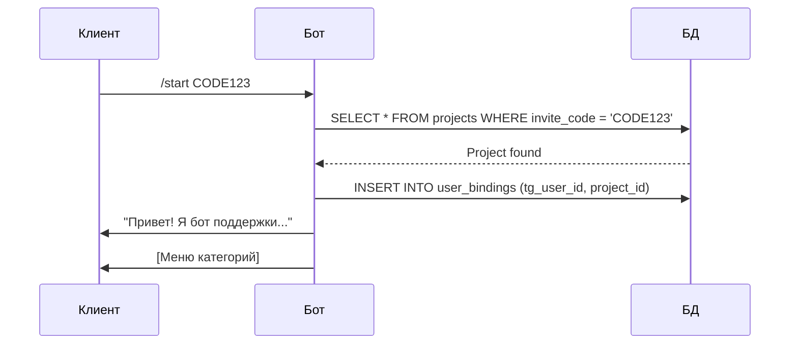

**Текст бота:**
> Привет! Я бот поддержки. Я аккуратно соберу детали и передам задачу команде — ничего не потеряется.
>
> Выберите, что случилось:

---

### 1.2 /start без кода (новый пользователь)

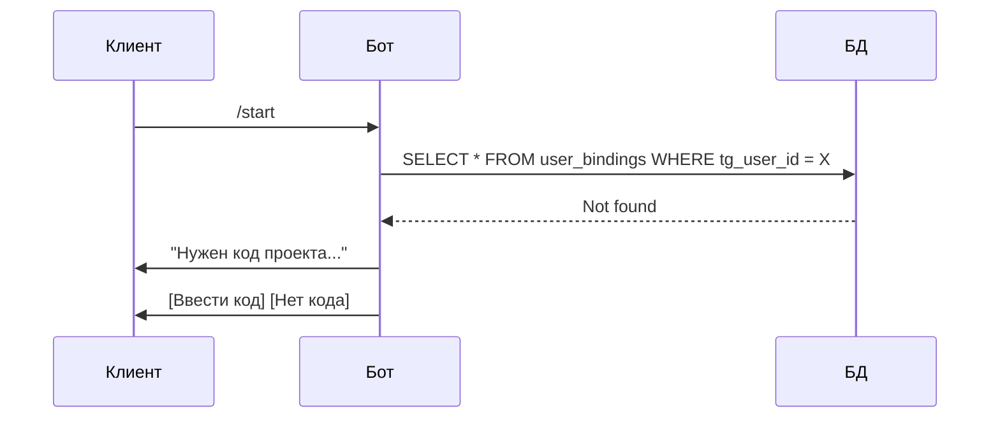

**Текст бота:**
> Привет! Чтобы я направил запрос правильно, нужен код проекта.
>
> Если кода нет — нажмите «Нет кода», мы разберёмся.

---

### 1.3 /start без кода (известный пользователь)

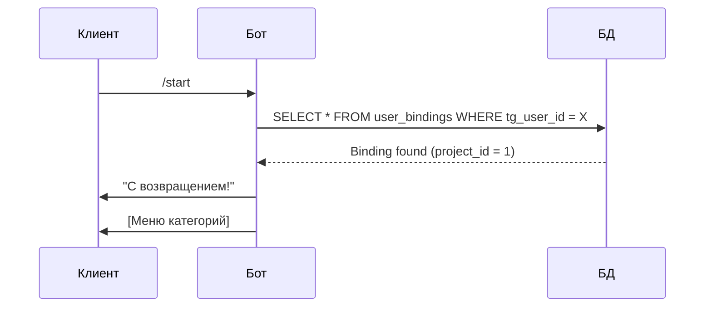

**Текст бота:**
> С возвращением! Выберите, что случилось:

---

### 1.4 /start с predefined username

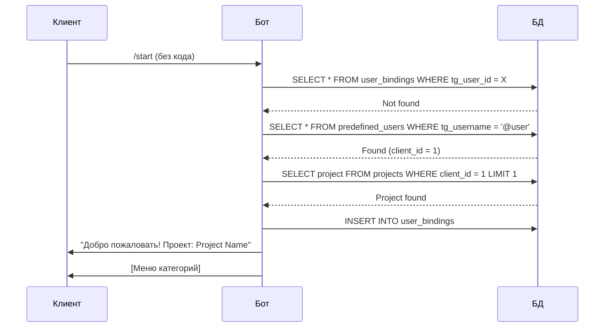

**Как это работает:**
1. Администратор заранее добавляет usernames пользователей в таблицу `predefined_users`
2. При `/start` бот проверяет username пользователя в этой таблице
3. Если найден — автоматически привязывает к первому проекту клиента

**Добавление пользователей:**
```bash
cd backend
python ../scripts/init_data.py add-user vbolshaeva "Demo Company"
python ../scripts/init_data.py list-users
```

---

### 1.5 Triage flow (нет кода)

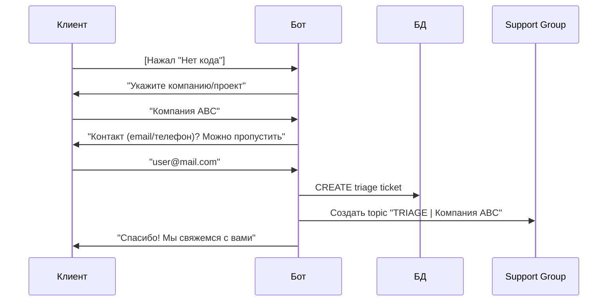

---

## 2. Создание тикета

### 2.1 Стандартный flow с превью

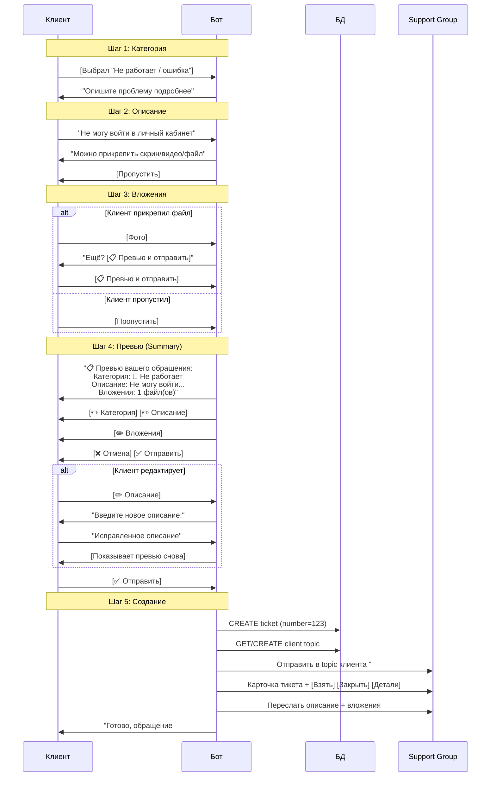

**Текст бота (превью):**
> 📋 Превью вашего обращения:
>
> 📁 Категория: 🐛 Не работает / ошибка
>
> 📝 Описание:
> Не могу войти в личный кабинет
>
> 📎 Вложения: 1 файл(ов)
>
> Всё верно?

**Текст бота (подтверждение):**
> ✅ Готово, обращение **#123** принято!
>
> Рабочие часы: Пн–Пт 10:00–19:00 (Europe/Madrid)
> Обычно отвечаем за 2–4 часа.

---

### 2.2 Topic per Client архитектура

Все тикеты от одной компании-клиента направляются в один и тот же topic (тему) в Support Group:

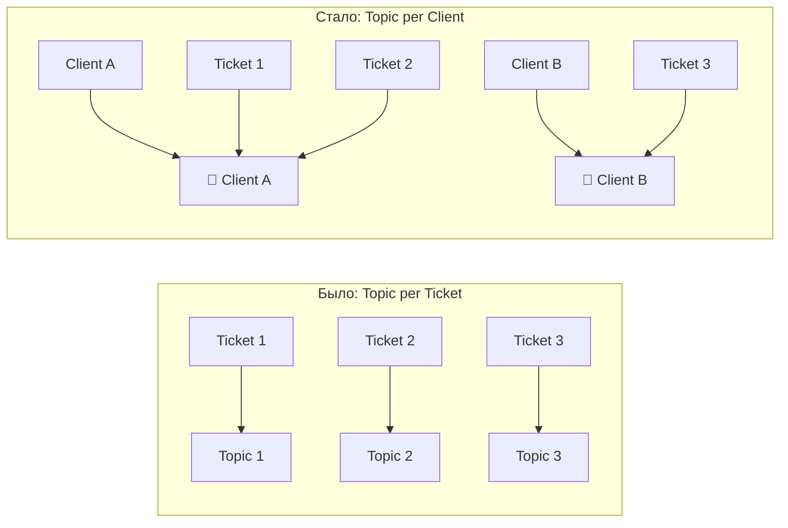

**Преимущества:**
- Вся история клиента в одном месте
- Операторы видят контекст предыдущих обращений
- Несколько пользователей от одной компании попадают в один topic

---

### 2.3 Flow "Срочно"

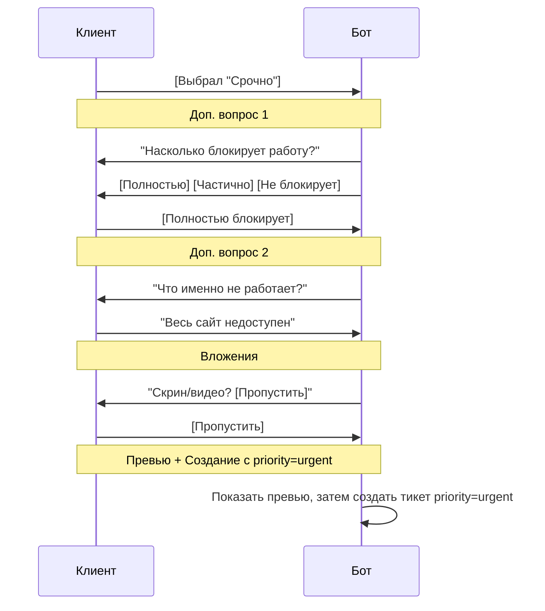

---

## 3. Активное обращение

### 3.1 Сообщение при открытом тикете

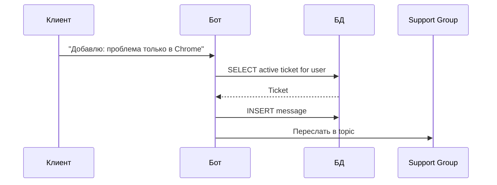

---

### 3.2 Сообщение после закрытия (< 48h)

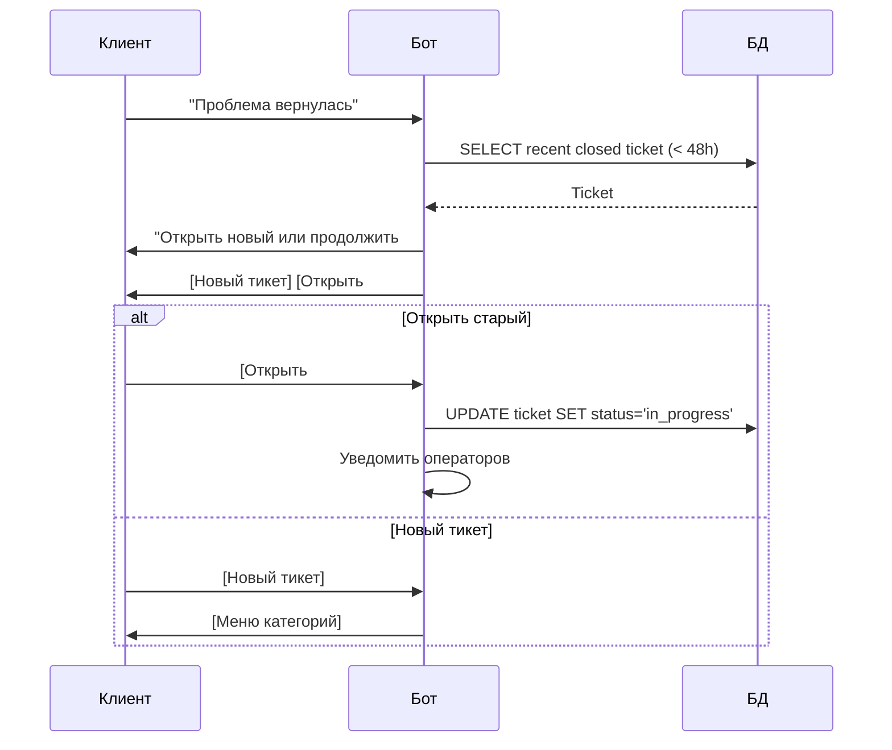

---

### 3.3 Сообщение после закрытия (> 48h)

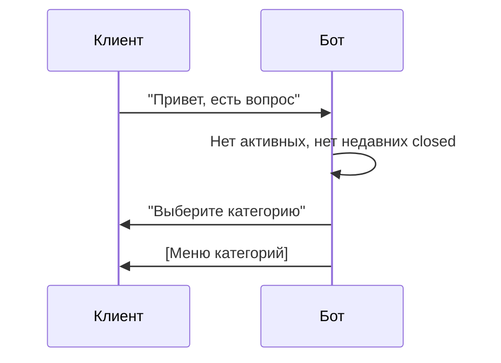

---

## 4. Работа оператора

### 4.1 Взять в работу

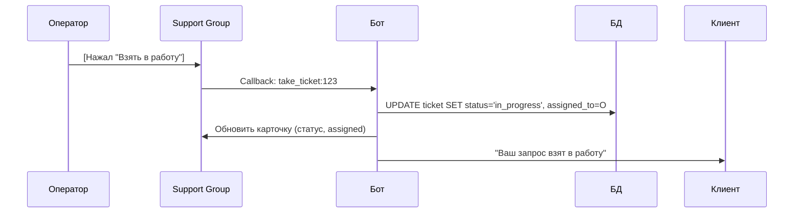

---

### 4.2 Ответ клиенту

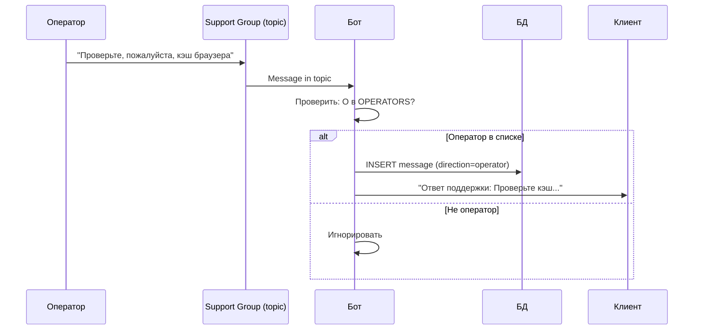

---

### 4.3 Запросить детали

```mermaid
sequenceDiagram
    participant O as Оператор
    participant G as Support Group
    participant B as Бот
    participant C as Клиент
    
    O->>G: [Нажал "Запросить детали"]
    G->>B: Callback: request_details:123
    B->>C: "Нужно чуть больше деталей:
           1. что вы делали перед проблемой
           2. ссылка/экран/раздел
           3. скрин/видео (если можно)"
```

---

### 4.4 Закрыть тикет

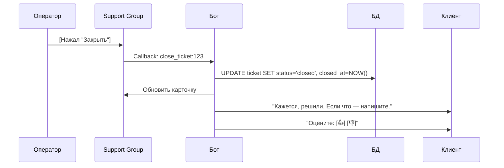

---

## 5. CSAT

### 5.1 Положительная оценка

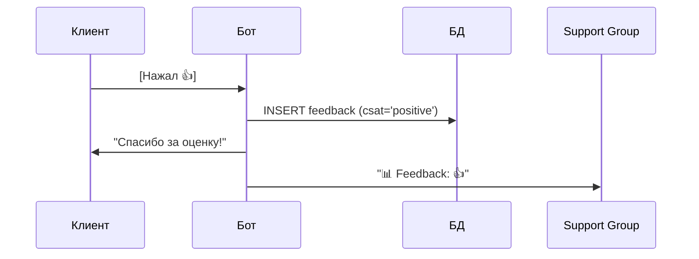

---

### 5.2 Негативная оценка

```mermaid
sequenceDiagram
    participant C as Клиент
    participant B as Бот
    participant D as БД
    participant G as Support Group
    
    C->>B: [Нажал 👎]
    B->>C: "Что было не так?"
    C->>B: "Долго ждал ответа"
    B->>D: INSERT feedback (csat='negative', comment='...')
    B->>C: "Спасибо, учтём!"
    B->>G: "📊 Feedback: 👎
           Комментарий: Долго ждал ответа"
```

---

## 6. Команда /project

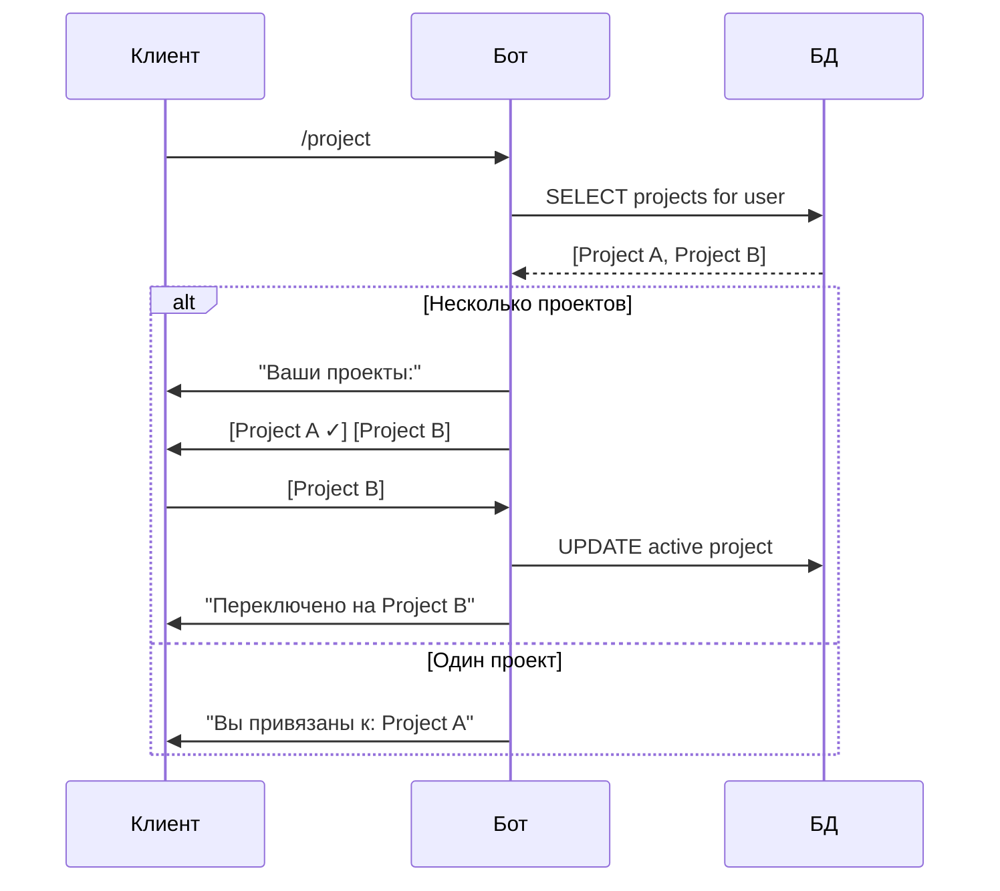

---

## 7. Edge Cases

### 7.1 Пользователь без username

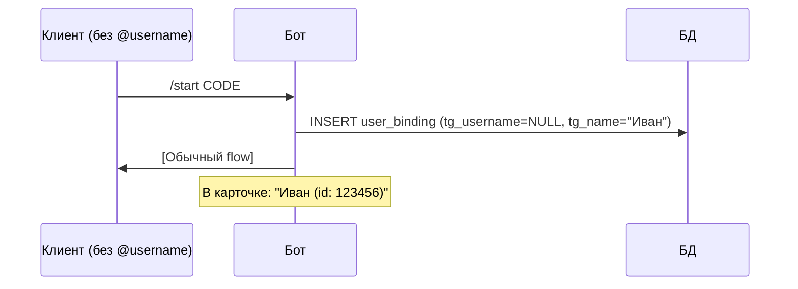

---

### 7.2 Два оператора нажали "Взять"

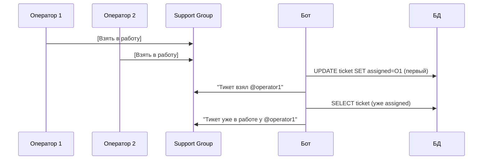

---

### 7.3 Несколько вложений подряд

```mermaid
sequenceDiagram
    participant C as Клиент
    participant B as Бот
    participant G as Support Group
    
    Note over C,B: В режиме ожидания вложений
    C->>B: [Фото 1]
    B->>B: Сохранить, показать [Ещё] [Готово]
    C->>B: [Фото 2]
    B->>B: Сохранить
    C->>B: [Документ]
    B->>B: Сохранить
    C->>B: [Готово]
    B->>B: Создать тикет
    B->>G: Переслать все 3 вложения
```

---

*Актуально для: 2026-02-05*
