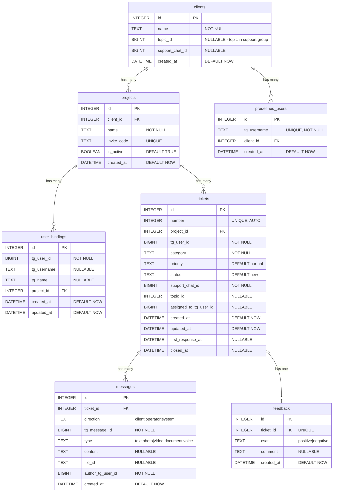

# Схема базы данных: SQLite

## Обзор

База данных SQLite для хранения:
- Клиентов и проектов
- Привязок пользователей Telegram
- Тикетов и сообщений
- Обратной связи (CSAT)

---

## ER-диаграмма



---

## Таблицы

### clients

Компании-клиенты. Каждый клиент имеет свой topic в support group (topic per client архитектура).

| Поле | Тип | Ограничения | Описание |
|------|-----|-------------|----------|
| id | INTEGER | PK, AUTOINCREMENT | Идентификатор |
| name | TEXT | NOT NULL | Название компании |
| topic_id | BIGINT | NULLABLE | ID topic в support group |
| support_chat_id | BIGINT | NULLABLE | ID чата support group |
| created_at | DATETIME | DEFAULT CURRENT_TIMESTAMP | Дата создания |

```sql
CREATE TABLE clients (
    id INTEGER PRIMARY KEY AUTOINCREMENT,
    name TEXT NOT NULL,
    topic_id BIGINT,
    support_chat_id BIGINT,
    created_at DATETIME DEFAULT CURRENT_TIMESTAMP
);
```

**Topic per Client:** Все тикеты от одной компании попадают в один topic (тему) в Telegram группе поддержки. Это позволяет видеть историю всех обращений клиента в одном месте.

---

### predefined_users

Предустановленные Telegram username для автоматической привязки к клиентам.

| Поле | Тип | Ограничения | Описание |
|------|-----|-------------|----------|
| id | INTEGER | PK, AUTOINCREMENT | Идентификатор |
| tg_username | TEXT | UNIQUE, NOT NULL | Telegram @username (без @, lowercase) |
| client_id | INTEGER | FK → clients.id | Компания-клиент |
| created_at | DATETIME | DEFAULT CURRENT_TIMESTAMP | Дата создания |

```sql
CREATE TABLE predefined_users (
    id INTEGER PRIMARY KEY AUTOINCREMENT,
    tg_username TEXT UNIQUE NOT NULL,
    client_id INTEGER NOT NULL,
    created_at DATETIME DEFAULT CURRENT_TIMESTAMP,
    FOREIGN KEY (client_id) REFERENCES clients(id) ON DELETE CASCADE
);

CREATE INDEX idx_predefined_users_tg_username ON predefined_users(tg_username);
CREATE INDEX idx_predefined_users_client_id ON predefined_users(client_id);
```

**Использование:** Администратор добавляет usernames сотрудников клиента. При `/start` бот автоматически привязывает пользователя к компании без invite-кода.

---

### projects

Проекты/контуры внутри компаний.

| Поле | Тип | Ограничения | Описание |
|------|-----|-------------|----------|
| id | INTEGER | PK, AUTOINCREMENT | Идентификатор |
| client_id | INTEGER | FK → clients.id | Компания |
| name | TEXT | NOT NULL | Название проекта |
| invite_code | TEXT | UNIQUE | Код для привязки |
| is_active | BOOLEAN | DEFAULT TRUE | Активен ли проект |
| created_at | DATETIME | DEFAULT CURRENT_TIMESTAMP | Дата создания |

```sql
CREATE TABLE projects (
    id INTEGER PRIMARY KEY AUTOINCREMENT,
    client_id INTEGER NOT NULL,
    name TEXT NOT NULL,
    invite_code TEXT UNIQUE,
    is_active BOOLEAN DEFAULT TRUE,
    created_at DATETIME DEFAULT CURRENT_TIMESTAMP,
    FOREIGN KEY (client_id) REFERENCES clients(id) ON DELETE CASCADE
);

CREATE INDEX idx_projects_invite_code ON projects(invite_code);
```

---

### user_bindings

Привязки пользователей Telegram к проектам.

| Поле | Тип | Ограничения | Описание |
|------|-----|-------------|----------|
| id | INTEGER | PK, AUTOINCREMENT | Идентификатор |
| tg_user_id | BIGINT | NOT NULL | Telegram user ID |
| tg_username | TEXT | NULLABLE | @username |
| tg_name | TEXT | NULLABLE | Имя пользователя |
| project_id | INTEGER | FK → projects.id | Активный проект |
| created_at | DATETIME | DEFAULT CURRENT_TIMESTAMP | Дата привязки |
| updated_at | DATETIME | DEFAULT CURRENT_TIMESTAMP | Дата обновления |

```sql
CREATE TABLE user_bindings (
    id INTEGER PRIMARY KEY AUTOINCREMENT,
    tg_user_id BIGINT NOT NULL,
    tg_username TEXT,
    tg_name TEXT,
    project_id INTEGER NOT NULL,
    created_at DATETIME DEFAULT CURRENT_TIMESTAMP,
    updated_at DATETIME DEFAULT CURRENT_TIMESTAMP,
    FOREIGN KEY (project_id) REFERENCES projects(id) ON DELETE CASCADE
);

CREATE INDEX idx_user_bindings_tg_user_id ON user_bindings(tg_user_id);
CREATE INDEX idx_user_bindings_project_id ON user_bindings(project_id);
```

**Примечание:** Один `tg_user_id` может иметь несколько привязок к разным проектам. Активный проект определяется логикой приложения (последний используемый).

---

### tickets

Обращения в поддержку.

| Поле | Тип | Ограничения | Описание |
|------|-----|-------------|----------|
| id | INTEGER | PK, AUTOINCREMENT | Идентификатор |
| number | INTEGER | UNIQUE, NOT NULL | Номер тикета (#NNNN) |
| project_id | INTEGER | FK → projects.id | Проект |
| tg_user_id | BIGINT | NOT NULL | Автор (Telegram ID) |
| category | TEXT | NOT NULL | Категория обращения |
| priority | TEXT | DEFAULT 'normal' | normal / urgent |
| status | TEXT | DEFAULT 'new' | new / in_progress / closed |
| support_chat_id | BIGINT | NOT NULL | ID группы поддержки |
| topic_id | INTEGER | NULLABLE | ID topic в группе |
| assigned_to_tg_user_id | BIGINT | NULLABLE | Оператор (Telegram ID) |
| created_at | DATETIME | DEFAULT CURRENT_TIMESTAMP | Создан |
| updated_at | DATETIME | DEFAULT CURRENT_TIMESTAMP | Обновлён |
| first_response_at | DATETIME | NULLABLE | Первый ответ |
| closed_at | DATETIME | NULLABLE | Закрыт |

```sql
CREATE TABLE tickets (
    id INTEGER PRIMARY KEY AUTOINCREMENT,
    number INTEGER UNIQUE NOT NULL,
    project_id INTEGER NOT NULL,
    tg_user_id BIGINT NOT NULL,
    category TEXT NOT NULL,
    priority TEXT DEFAULT 'normal' CHECK (priority IN ('normal', 'urgent')),
    status TEXT DEFAULT 'new' CHECK (status IN ('new', 'in_progress', 'closed')),
    support_chat_id BIGINT NOT NULL,
    topic_id INTEGER,
    assigned_to_tg_user_id BIGINT,
    created_at DATETIME DEFAULT CURRENT_TIMESTAMP,
    updated_at DATETIME DEFAULT CURRENT_TIMESTAMP,
    first_response_at DATETIME,
    closed_at DATETIME,
    FOREIGN KEY (project_id) REFERENCES projects(id) ON DELETE CASCADE
);

CREATE INDEX idx_tickets_tg_user_id ON tickets(tg_user_id);
CREATE INDEX idx_tickets_status ON tickets(status);
CREATE INDEX idx_tickets_project_id ON tickets(project_id);
CREATE INDEX idx_tickets_topic_id ON tickets(topic_id);
```

---

### messages

Сообщения в рамках тикета.

| Поле | Тип | Ограничения | Описание |
|------|-----|-------------|----------|
| id | INTEGER | PK, AUTOINCREMENT | Идентификатор |
| ticket_id | INTEGER | FK → tickets.id | Тикет |
| direction | TEXT | NOT NULL | client / operator / system |
| tg_message_id | BIGINT | NOT NULL | ID сообщения в Telegram |
| type | TEXT | NOT NULL | text / photo / video / document / voice |
| content | TEXT | NULLABLE | Текст сообщения |
| file_id | TEXT | NULLABLE | Telegram file_id |
| author_tg_user_id | BIGINT | NOT NULL | Автор (Telegram ID) |
| created_at | DATETIME | DEFAULT CURRENT_TIMESTAMP | Создано |

```sql
CREATE TABLE messages (
    id INTEGER PRIMARY KEY AUTOINCREMENT,
    ticket_id INTEGER NOT NULL,
    direction TEXT NOT NULL CHECK (direction IN ('client', 'operator', 'system')),
    tg_message_id BIGINT NOT NULL,
    type TEXT NOT NULL CHECK (type IN ('text', 'photo', 'video', 'document', 'voice', 'audio')),
    content TEXT,
    file_id TEXT,
    author_tg_user_id BIGINT NOT NULL,
    created_at DATETIME DEFAULT CURRENT_TIMESTAMP,
    FOREIGN KEY (ticket_id) REFERENCES tickets(id) ON DELETE CASCADE
);

CREATE INDEX idx_messages_ticket_id ON messages(ticket_id);
```

---

### feedback

Оценки после закрытия тикета.

| Поле | Тип | Ограничения | Описание |
|------|-----|-------------|----------|
| id | INTEGER | PK, AUTOINCREMENT | Идентификатор |
| ticket_id | INTEGER | FK → tickets.id, UNIQUE | Тикет |
| csat | TEXT | NOT NULL | positive (👍) / negative (👎) |
| comment | TEXT | NULLABLE | Комментарий при 👎 |
| created_at | DATETIME | DEFAULT CURRENT_TIMESTAMP | Создано |

```sql
CREATE TABLE feedback (
    id INTEGER PRIMARY KEY AUTOINCREMENT,
    ticket_id INTEGER UNIQUE NOT NULL,
    csat TEXT NOT NULL CHECK (csat IN ('positive', 'negative')),
    comment TEXT,
    created_at DATETIME DEFAULT CURRENT_TIMESTAMP,
    FOREIGN KEY (ticket_id) REFERENCES tickets(id) ON DELETE CASCADE
);

CREATE INDEX idx_feedback_ticket_id ON feedback(ticket_id);
```

---

## Основные операции (SQL)

### Создание тикета

```sql
INSERT INTO tickets (number, project_id, tg_user_id, category, priority, support_chat_id)
VALUES (
    (SELECT COALESCE(MAX(number), 0) + 1 FROM tickets),
    :project_id,
    :tg_user_id,
    :category,
    :priority,
    :support_chat_id
);
```

### Получение активного тикета пользователя

```sql
SELECT * FROM tickets 
WHERE tg_user_id = :tg_user_id 
  AND status != 'closed'
ORDER BY created_at DESC
LIMIT 1;
```

### Привязка пользователя к проекту

```sql
INSERT INTO user_bindings (tg_user_id, tg_username, tg_name, project_id)
VALUES (:tg_user_id, :tg_username, :tg_name, :project_id)
ON CONFLICT (tg_user_id, project_id) DO UPDATE SET
    tg_username = :tg_username,
    tg_name = :tg_name,
    updated_at = CURRENT_TIMESTAMP;
```

### Смена статуса тикета

```sql
UPDATE tickets 
SET status = :status,
    assigned_to_tg_user_id = CASE WHEN :status = 'in_progress' THEN :operator_id ELSE assigned_to_tg_user_id END,
    closed_at = CASE WHEN :status = 'closed' THEN CURRENT_TIMESTAMP ELSE NULL END,
    first_response_at = CASE WHEN first_response_at IS NULL AND :status = 'in_progress' THEN CURRENT_TIMESTAMP ELSE first_response_at END,
    updated_at = CURRENT_TIMESTAMP
WHERE id = :ticket_id;
```

### Сохранение CSAT

```sql
INSERT INTO feedback (ticket_id, csat, comment)
VALUES (:ticket_id, :csat, :comment);
```

---

## Индексы

| Таблица | Индекс | Поля |
|---------|--------|------|
| predefined_users | idx_predefined_users_tg_username | tg_username |
| predefined_users | idx_predefined_users_client_id | client_id |
| projects | idx_projects_invite_code | invite_code |
| user_bindings | idx_user_bindings_tg_user_id | tg_user_id |
| user_bindings | idx_user_bindings_project_id | project_id |
| tickets | idx_tickets_tg_user_id | tg_user_id |
| tickets | idx_tickets_status | status |
| tickets | idx_tickets_project_id | project_id |
| tickets | idx_tickets_topic_id | topic_id |
| messages | idx_messages_ticket_id | ticket_id |
| feedback | idx_feedback_ticket_id | ticket_id |

---

## Миграции

При использовании SQLite рекомендуется:
1. Начальная схема в `scripts/init_db.sql`
2. Миграции через alembic (опционально) или ручные SQL скрипты

---

*Актуально для: 2026-02-05*
