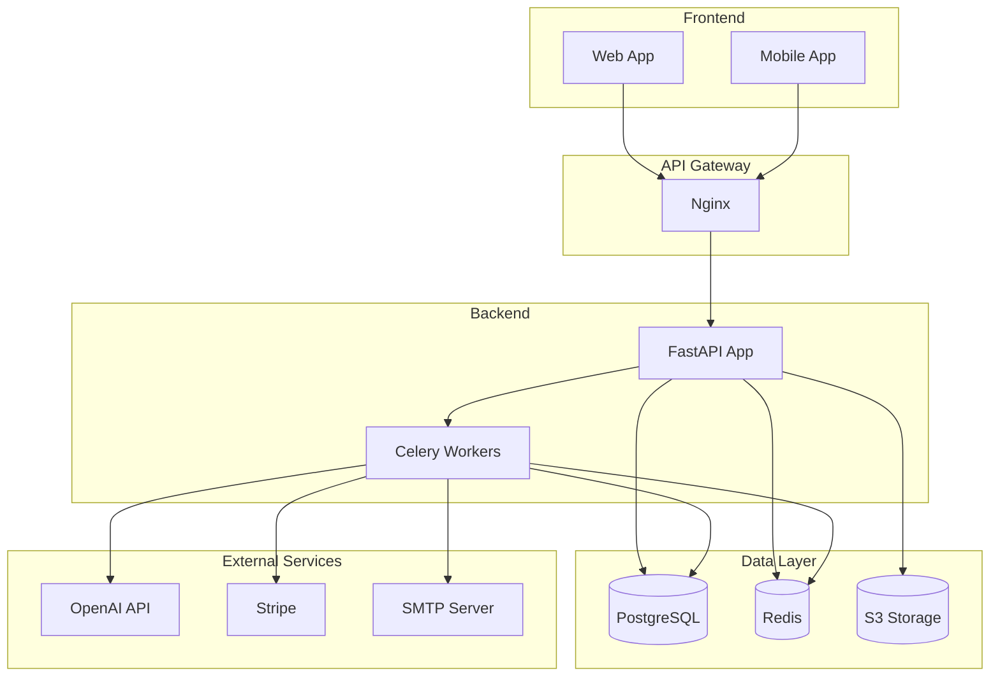
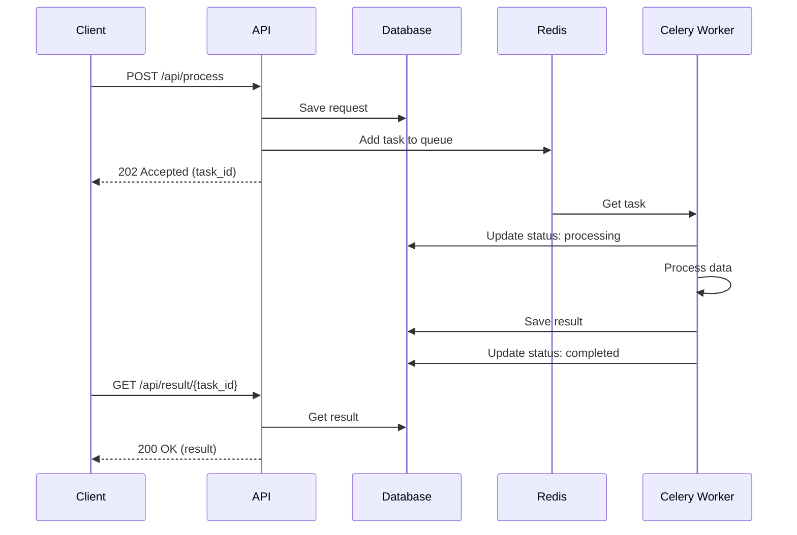
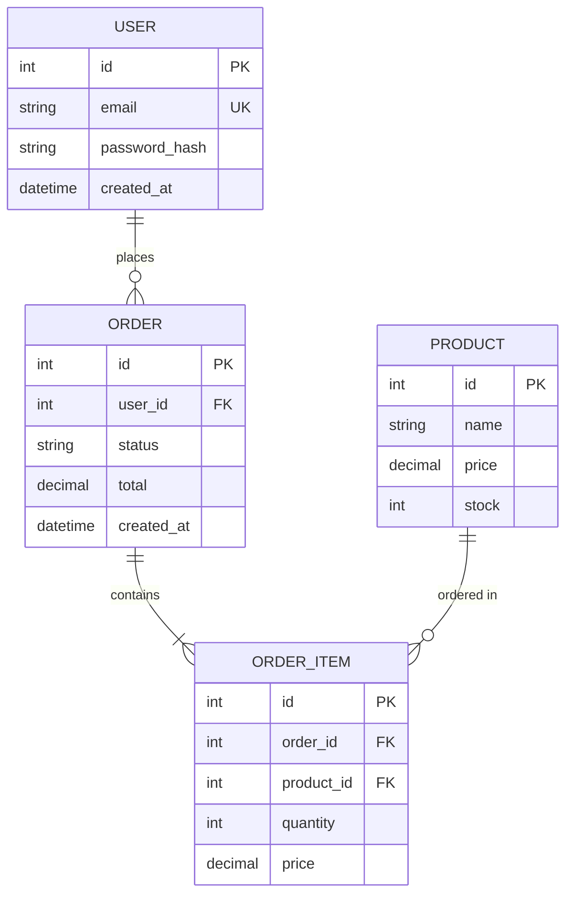

# 📘 Dev Playbook — Универсальные правила разработки в Cursor

> Универсальное руководство для разработки любого проекта с использованием AI-агентов в Cursor IDE.
> Версия: 1.1 | Актуально для: 2026

---

## 📁 1. Структура репозитория (минимальный скелет)

Каждый проект ДОЛЖЕН содержать следующую структуру:

```
project_root/
├── .cursorrules              # Правила для Cursor AI агентов
├── .env                      # Переменные окружения (создаёт РАЗРАБОТЧИК, не AI!)
├── .env.example              # Пример переменных окружения (БЕЗ секретов!)
├── .gitignore                # Игнорируемые файлы
├── .flake8                   # Конфигурация линтера
├── README.md                 # Быстрый старт (30 сек: что это и как запустить)
├── CLAUDE.md                 # Правила для Claude Code (опционально)
├── settings.py               # Pydantic Settings (для микросервисов — в корне)
│
├── app/                      # Основной код приложения
│   ├── __init__.py           # Файл инициализации для Python
│   ├── settings.py           # Pydantic Settings (для монолита — внутри app/)
│   └── ...
│
├── tests/                    # Тесты
│   ├── unit/
│   ├── integration/
│   └── e2e/
│
├── scripts/                  # Вспомогательные скрипты
│   └── ...
│
├── docs/                     # 📚 Документация (ИСТОЧНИК ПРАВДЫ)
│   ├── project-plan.md       # План проекта по фазам
│   ├── technical-summary.md  # Техническое описание системы
│   ├── agent-prompts.md      # Промпты для агентов (по волнам)
│   ├── architecture.md       # Архитектура (Mermaid диаграммы)
│   ├── changelogs/           # Changelog'и агентов
│   │   ├── wave-1-agent-1.md
│   │   └── ...
│   └── production/           # 📖 Документация для внешних разработчиков
│       ├── README.md         # Общая вводная про сервис
│       ├── api-reference.md  # Описание внешнего API
│       ├── database-schema.md # Описание БД и структур данных
│       └── quick-reference.md # Шпаргалка
│
├── temporary/                # Временные скрипты/эксперименты (Фаза 0)
│   └── ...
│
├── docker-compose.yml        # Docker Compose для production
├── docker-compose-dev.yml    # Docker Compose для разработки
└── Dockerfile                # Основной Dockerfile
```

### Обязательные файлы

| Файл | Назначение | Кто создаёт |
|------|------------|-------------|
| `.cursorrules` | Правила и контекст для AI-агентов Cursor | МОЗГ |
| `.env` | Реальные секреты и конфигурация | **РАЗРАБОТЧИК (человек!)** |
| `.env.example` | Пример конфигурации с инструкциями | МОЗГ/Агент |
| `.gitignore` | Исключения из Git | МОЗГ |
| `.flake8` | Конфигурация линтера | МОЗГ |
| `settings.py` | Pydantic Settings (валидация конфига) | МОЗГ/Агент |
| `README.md` | Быстрый старт для нового разработчика | МОЗГ |
| `docs/project-plan.md` | Согласованный план по фазам | МОЗГ |
| `docs/technical-summary.md` | Полное техническое описание | МОЗГ |
| `docs/agent-prompts.md` | Промпты для запуска агентов | МОЗГ |
| `docs/architecture.md` | Архитектурные диаграммы | МОЗГ |

> ⚠️ **ВАЖНО:** Файл `.env` создаёт только ЧЕЛОВЕК-разработчик! AI-агенты НИКОГДА не должны создавать или редактировать `.env` — только `.env.example`.

---

## 🐳 2. Docker

### Обязательные Docker-файлы

**Dockerfile** — основной образ приложения:
```dockerfile
FROM python:3.11-slim

WORKDIR /app

# Зависимости
COPY requirements.txt .
RUN pip install --no-cache-dir -r requirements.txt

# Код
COPY . .

# Запуск
CMD ["uvicorn", "main:app", "--host", "0.0.0.0", "--port", "8000"]
```

**docker-compose-dev.yml** — для локальной разработки:
```yaml
version: '3.8'

services:
  app:
    build: .
    ports:
      - "8000:8000"
    volumes:
      - .:/app  # Hot reload
    env_file:
      - .env
    depends_on:
      - db
      - redis

  db:
    image: postgres:16
    environment:
      POSTGRES_USER: ${DB_USER}
      POSTGRES_PASSWORD: ${DB_PASSWORD}
      POSTGRES_DB: ${DB_NAME}
    ports:
      - "5432:5432"
    volumes:
      - postgres_data:/var/lib/postgresql/data

  redis:
    image: redis:7-alpine
    ports:
      - "6379:6379"

volumes:
  postgres_data:
```

**docker-compose.yml** — для production (без volumes, без dev-зависимостей).

### Команды Docker

```bash
# Разработка
docker-compose -f docker-compose-dev.yml up -d      # Запуск
docker-compose -f docker-compose-dev.yml logs -f    # Логи
docker-compose -f docker-compose-dev.yml down       # Остановка

# Production
docker-compose up -d --build
```

---

## 🔐 3. Секреты и конфигурация

### Золотые правила

```
✅ Секреты — ТОЛЬКО в .env (никогда не коммитим!)
✅ В репозитории — ТОЛЬКО .env.example (с плейсхолдерами)
✅ Валидация конфига — через Pydantic Settings
❌ НИКОГДА не хардкодить API ключи, пароли, токены в код
❌ AI-агенты НИКОГДА не создают/редактируют .env
```

### Pydantic Settings (обязательно!)

Вместо `os.getenv()` используем **Pydantic Settings** для:
- ✅ Валидации при старте (приложение не запустится без обязательных переменных)
- ✅ Type hints и автодополнение
- ✅ Единого источника правды о конфигурации

**Расположение файла:**
- **Монолит**: `app/settings.py`
- **Микросервисы**: `settings.py` в корне каждого сервиса

**Пример `settings.py`:**

```python
"""
Конфигурация приложения через Pydantic Settings.

Все переменные окружения валидируются при старте приложения.
Если обязательная переменная отсутствует — приложение НЕ запустится.
"""

from pydantic import Field, field_validator
from pydantic_settings import BaseSettings, SettingsConfigDict


class DatabaseSettings(BaseSettings):
    """Настройки подключения к PostgreSQL."""
    
    model_config = SettingsConfigDict(env_prefix="DB_")
    
    host: str = Field(description="Хост базы данных")
    port: int = Field(default=5432, description="Порт базы данных")
    user: str = Field(description="Имя пользователя")
    password: str = Field(description="Пароль")
    name: str = Field(description="Имя базы данных")
    
    @property
    def url(self) -> str:
        """Сформировать URL подключения."""
        return f"postgresql+asyncpg://{self.user}:{self.password}@{self.host}:{self.port}/{self.name}"


class ExternalAPISettings(BaseSettings):
    """Настройки внешних API."""
    
    model_config = SettingsConfigDict(env_prefix="")
    
    # Пример с валидацией
    openai_api_key: str = Field(description="OpenAI API Key")
    
    @field_validator("openai_api_key")
    @classmethod
    def validate_openai_key(cls, v: str) -> str:
        if not v.startswith("sk-"):
            raise ValueError("OpenAI API key должен начинаться с 'sk-'")
        return v


class Settings(BaseSettings):
    """Главный класс настроек приложения."""
    
    model_config = SettingsConfigDict(
        env_file=".env",
        env_file_encoding="utf-8",
        env_nested_delimiter="__",
        extra="ignore",
    )
    
    # Вложенные настройки
    db: DatabaseSettings = DatabaseSettings()
    api: ExternalAPISettings = ExternalAPISettings()
    
    # Простые настройки
    debug: bool = Field(default=False, description="Режим отладки")
    environment: str = Field(default="local", description="Окружение: local/dev/prod")


# Singleton — создаётся один раз при импорте
settings = Settings()
```

**Использование:**
```python
from app.settings import settings

# Вместо os.getenv("DB_HOST")
db_url = settings.db.url
api_key = settings.api.openai_api_key
```

### Обязательно в .gitignore

```gitignore
# Environment (НИКОГДА не коммитим!)
.env
.env.local
.env.*.local

# Secrets
*.pem
*.key
*credentials*.json
*secret*.json
token.json

# Temporary
tmp/
temp/
temporary/
__pycache__/
*.pyc
.venv/
venv/
node_modules/

# IDE
.idea/
.vscode/
*.swp

# Build
dist/
build/
*.egg-info/

# Docker
docker-compose.override.yml
```

### Формат .env.example (ПОДРОБНЫЙ!)

Каждый API ключ должен содержать:
- 📝 Описание что это за ключ
- 🔗 Где получить (URL)
- 🔑 Какие scopes/permissions нужны
- 👤 Тип ключа (admin/read-only/etc)
- 📋 Инструкции по созданию

```bash
# ==============================================================================
# 🔐 БАЗА ДАННЫХ — PostgreSQL
# ==============================================================================
# Хост базы данных (localhost для локальной разработки, имя сервиса для Docker)
DB_HOST=localhost

# Порт PostgreSQL (стандартный: 5432)
DB_PORT=5432

# Имя пользователя БД (создать: CREATE USER myuser WITH PASSWORD 'pass';)
DB_USER=your_username

# Пароль пользователя БД
DB_PASSWORD=your_password_here

# Имя базы данных (создать: CREATE DATABASE mydb OWNER myuser;)
DB_NAME=your_database

# ==============================================================================
# 🤖 OPENAI API
# ==============================================================================
# API ключ OpenAI
# Получить: https://platform.openai.com/api-keys
# Тип: Secret Key (начинается с "sk-")
# Права: Полный доступ к API (gpt-4, gpt-3.5-turbo, embeddings)
# Лимиты: Зависят от тарифа ($5-$120/месяц)
# Создание нового: Settings → API Keys → Create new secret key
OPENAI_API_KEY=sk-your-api-key-here

# ==============================================================================
# 📊 GOOGLE SHEETS API
# ==============================================================================
# Service Account JSON файл
# Получить: https://console.cloud.google.com/iam-admin/serviceaccounts
# 
# ИНСТРУКЦИЯ ПО СОЗДАНИЮ:
# 1. Создать проект в Google Cloud Console
# 2. Включить Google Sheets API: APIs & Services → Enable APIs → Google Sheets API
# 3. Создать Service Account: IAM & Admin → Service Accounts → Create
# 4. Скачать JSON ключ: Actions → Manage keys → Add key → JSON
# 5. Расшарить нужные таблицы на email сервис-аккаунта
#
# НЕОБХОДИМЫЕ SCOPES (включаются автоматически для Service Account):
# - https://www.googleapis.com/auth/spreadsheets (чтение/запись таблиц)
# - https://www.googleapis.com/auth/drive.readonly (доступ к файлам)
#
# Тип: Service Account (не OAuth!)
# Права: Editor (для записи) или Viewer (только чтение)
GOOGLE_SERVICE_ACCOUNT_FILE=path/to/service-account.json

# ID таблицы (из URL: https://docs.google.com/spreadsheets/d/{SPREADSHEET_ID}/edit)
GOOGLE_SPREADSHEET_ID=1BxiMVs0XRA5nFMdKvBdBZjgmUUqptlbs74OgvE2upms

# ==============================================================================
# 📧 SMTP (Email)
# ==============================================================================
# SMTP сервер
# Gmail: smtp.gmail.com (требует App Password, не обычный пароль!)
# Yandex: smtp.yandex.ru
# Mail.ru: smtp.mail.ru
SMTP_HOST=smtp.gmail.com

# Порт: 587 (STARTTLS) или 465 (SSL)
SMTP_PORT=587

# Email аккаунт
SMTP_USER=your-email@gmail.com

# Пароль приложения (НЕ пароль от почты!)
# Gmail: https://myaccount.google.com/apppasswords
# Требования: Включить 2FA, создать App Password для "Mail"
SMTP_PASSWORD=your-app-password-here

# ==============================================================================
# 🔧 ПРИЛОЖЕНИЕ
# ==============================================================================
# Режим отладки (true = подробные логи, auto-reload)
DEBUG=false

# Окружение: local / dev / staging / prod
ENVIRONMENT=local

# Секретный ключ для JWT (генерировать: openssl rand -hex 32)
JWT_SECRET=your-secret-key-minimum-32-characters
```

---

## 🌊 4. Процесс разработки "волнами" агентов

### Иерархия

```
Проект
└── Фаза (крупная цель продукта)
    └── Волна (группа параллельных агентов)
        └── Агент (одна конкретная задача)
```

### Определения

| Термин | Описание |
|--------|----------|
| **Фаза** | Крупная цель продукта (например: "Авторизация", "API v2", "Health Check") |
| **Волна** | Группа агентов, работающих ПАРАЛЛЕЛЬНО без зависимостей друг от друга |
| **Агент** | Один AI-агент, выполняющий одну конкретную задачу |
| **Core/Мозг** | Главный агент, координирующий работу и проверяющий результаты |

### 4.1 Правила формирования волн

**В одной волне агенты:**
- ✅ НЕ редактируют одни и те же файлы/папки
- ✅ НЕ используют результаты друг друга
- ✅ Могут работать полностью параллельно

**Если задача B зависит от результата задачи A — это РАЗНЫЕ волны:**
```
Wave N:   Агент A создаёт модуль/файл
Wave N+1: Агент B использует этот модуль/файл
```

### 4.2 Контракт агента (обязательства)

Каждый агент ОБЯЗАН:

1. **🔍 ПЕРВЫМ ДЕЛОМ — изучить контекст:**
   - Прочитать `docs/project-plan.md` — общий план
   - Прочитать `docs/technical-summary.md` — архитектура
   - Прочитать `.cursorrules` — правила кодирования
   - Осознать своё место в проекте и конкретную задачу
   - **Только после этого приступать к выполнению!**

2. **Дать законченный результат** — не "половину половины"

3. **Не выходить за свою зону файлов** — только те папки, что указаны в промпте

4. **Написать changelog** в `docs/changelogs/wave-X-agent-Y.md`:
   - Что сделал
   - Какие файлы создал/изменил
   - Как проверить работу
   - Известные ограничения

### 4.3 Роль "Мозга проекта" (Core Agent)

**МОЗГ — это планировщик, координатор и контролёр. НЕ исполнитель!**

Core/Мозг отвечает за:

- 📖 Читает changelog'и и проверяет реальный код
- 🔧 Выявляет конфликты/дубли/баги между агентами
- 📝 Обновляет документацию (`technical-summary.md`, план, промпты)
- 🏗️ Держит "единый взгляд" на архитектуру
- ✅ Принимает или отклоняет работу агентов
- 🚀 Управляет Git (коммиты, ветки)

**⚠️ КРИТИЧЕСКИ ВАЖНО:**

> **МОЗГ НЕ ДОЛЖЕН сам писать код и исправлять баги!**
> 
> Если МОЗГ или разработчик обнаружил проблему:
> 1. МОЗГ пишет промпт для исправления
> 2. Разработчик запускает новый чат с новым агентом
> 3. Агент исправляет проблему
> 4. Разработчик сообщает МОЗГу что готово
> 5. МОЗГ проверяет и принимает работу
>
> **Почему:** Если МОЗГ сам кодит — его контекст засоряется деталями реализации,
> и он теряет способность видеть проект целиком.

**Workflow принятия работы:**

```
1. Агенты завершили волну
2. МОЗГ проверяет результаты
3. Если есть проблемы → МОЗГ пишет промпт для исправления → п.1
4. Если всё ок → МОЗГ спрашивает: "Могу сделать коммит?"
5. Разработчик: "Да, всё ок"
6. МОЗГ делает коммит
7. МОЗГ: "Запускаем следующую волну?"
```

### 4.4 Правильный размер задачи для агента

**Хороший размер задачи:**
- Результат можно проверить 1-2 командами
- Изменения касаются ОДНОЙ зоны (например `app/auth/` или `app/api/v2/`)
- Нет необходимости координировать других агентов в этой же волне
- **1 агент = 1 законченное улучшение**

**Слишком мелко (плохо):**
- "Переименовать переменную" — делает Core в рамках ревью
- "Добавить одну строку лога" — делает Core

**Слишком крупно (плохо):**
- "Сделать весь микросервис + UI + webhooks" — нужно дробить на фазы/волны

### 4.5 Шаблон промпта для агента

```markdown
## [Уникальное название чата с агентом] 
Agent X.Y — [Название задачи]

### Контекст
Ты — AI-агент в Cursor IDE. Твоя задача: [описание].

### ⚠️ ОБЯЗАТЕЛЬНО СНАЧАЛА
**Прежде чем писать код — изучи проект:**
1. Прочитай `docs/project-plan.md` — пойми общий план
2. Прочитай `docs/technical-summary.md` — пойми архитектуру
3. Прочитай `.cursorrules` — запомни правила кодирования
4. Осознай своё место и задачу в контексте всего проекта
5. **Только после этого приступай к выполнению!**

### Твоя зона ответственности
Ты работаешь ТОЛЬКО с этими файлами:
- `app/module_name/` — создать/изменить
- `tests/unit/module_name/` — написать тесты

### НЕ ТРОГАЙ
- `app/other_module/` — это зона другого агента
- `docs/` — это зона Core

### Задачи
1. [ ] Создать X
2. [ ] Реализовать Y
3. [ ] Написать тесты
4. [ ] Создать changelog в `docs/changelogs/wave-X-agent-Y.md`

### Definition of Done
- [ ] Код работает без ошибок
- [ ] Все тесты проходят
- [ ] Changelog написан
```

---

## 🧪 5. Правила тестирования

### 5.1 Типы тестов

| Тип | Скорость | Зависимости | Когда запускать |
|-----|----------|-------------|-----------------|
| **Unit** | < 1 сек | Нет (моки) | Каждый коммит |
| **Integration** | 1-10 сек | БД, Redis | Pull Request |
| **E2E** | > 10 сек | Всё | Перед релизом |
| **Load** | Минуты | Всё | Периодически |

### 5.2 Минимальные требования

**Каждый endpoint = минимум 5 тестов:**

```python
class TestMyEndpoint:
    async def test_success(self):
        """✅ Успешный сценарий (200/201)"""
        
    async def test_unauthorized(self):
        """🔐 Без авторизации (401)"""
        
    async def test_forbidden(self):
        """🚫 Нет прав доступа (403)"""
        
    async def test_not_found(self):
        """❓ Ресурс не найден (404)"""
        
    async def test_validation_error(self):
        """⚠️ Невалидные данные (422)"""
```

**Каждый сервис/процессор = минимум 3 теста:**

```python
class TestMyService:
    async def test_happy_path(self):
        """✅ Успешный сценарий"""
        
    async def test_edge_case(self):
        """🔄 Граничные случаи"""
        
    async def test_error_handling(self):
        """❌ Обработка ошибок"""
```

### 5.3 Маркеры pytest

```python
@pytest.mark.unit          # Быстрые изолированные тесты
@pytest.mark.integration   # Требуют БД/Redis/внешние сервисы
@pytest.mark.slow          # Долгие тесты (> 5 сек)
@pytest.mark.external      # Требуют внешние API (не в CI)
@pytest.mark.smoke         # Базовые проверки работоспособности
```

### 5.4 Перед каждым коммитом

```bash
# ВСЕГДА запускать:
pytest -v --tb=short

# Если тесты упали — исправить ДО коммита!
```

---

## 🐛 6. Классификация ошибок (Severity)

### Стандарт ISTQB (S1-S5)

| Severity | Название | Описание | SLA |
|----------|----------|----------|-----|
| **S1** | 🔴 BLOCKER | Система мертва. Тестирование/работа невозможны. | 30 минут |
| **S2** | 🟠 CRITICAL | Ключевая функция не работает, workaround нет. | 2 часа |
| **S3** | 🟡 MAJOR | Функция работает неправильно, но есть workaround. | 6 часов |
| **S4** | 🔵 MINOR | Неудобство пользователю, но всё работает. | 2 дня |
| **S5** | ⚪ TRIVIAL | Косметика (опечатки, мелкие UI баги). | 2 недели |

### Примеры

**S1 BLOCKER:**
- Сайт выдаёт 500 ошибку при любом запросе
- База данных недоступна
- Сервис не запускается

**S2 CRITICAL:**
- Не работает авторизация
- Не работают платежи
- Потеря данных пользователя

**S3 MAJOR:**
- Не работает один метод оплаты (другие работают)
- Медленная загрузка страницы (> 10 сек)
- Некорректный расчёт, но можно пересчитать вручную

**S4 MINOR:**
- Кнопка съехала на 5 пикселей
- Неудобная навигация
- Отсутствует валидация на клиенте (есть на сервере)

**S5 TRIVIAL:**
- Опечатка в тексте
- Неправильный оттенок цвета
- Пропущенная запятая

### Severity vs Priority

```
Severity = Насколько технически сломана система (объективный факт)
Priority = Как быстро нужно чинить (бизнес-решение)

Пример:
- Опечатка в названии компании на главной
- Severity: S5 (система работает)
- Priority: P1 (репутация, чинить немедленно!)
```

---

## 🔀 7. Git Workflow

### ⚠️ ПЕРВЫМ ДЕЛОМ — Инициализация Git

**МОЗГ обязан в начале проекта (до написания кода):**

1. Инициализировать Git репозиторий
2. Создать `.gitignore`
3. Сделать первый коммит со стартовыми файлами
4. Настроить структуру веток

```bash
# Инициализация
git init
git add .
git commit -m "chore: initial project setup"

# Создать remote (если нужно)
git remote add origin https://github.com/user/repo.git
git push -u origin main
```

### Режимы Git Workflow

#### 🏠 Режим "Pet Project" (1 разработчик)

**Для личных проектов, экспериментов, MVP:**

```
main — единственная ветка, коммитим напрямую
```

**Правила:**
- ✅ Коммитим напрямую в `main`
- ✅ Пушим сразу после коммита
- ❌ Не нужны Pull Request'ы
- ❌ Не нужны ревью

```bash
git add .
git commit -m "feat: add user authentication"
git push
```

#### 🏢 Режим "Production" (команда, продакшн)

**Для серьёзных проектов с продакшеном и командой:**

```
main        — стабильная ветка (продакшн), защищённая
test        — интеграционная ветка (стейджинг)
feature/*   — ветки под фичи
bugfix/*    — ветки под баг-фиксы
hotfix/*    — срочные фиксы продакшна
```

**Правила:**
- ❌ **НИКОГДА не коммитить напрямую в `main`**
- ✅ Все изменения через Pull Request
- ✅ Минимум 1 ревью перед мержем
- ✅ CI/CD должен проходить успешно
- ✅ Ветка должна быть up-to-date с main

```bash
# Создать ветку
git checkout -b feature/user-auth

# Работа...
git add .
git commit -m "feat: add user authentication"
git push -u origin feature/user-auth

# Создать Pull Request через GitHub/GitLab
# После ревью и approve — merge в main
```

#### Переключение режима

В начале проекта МОЗГ определяет режим и фиксирует в `docs/project-plan.md`:

```markdown
## Git Workflow
**Режим:** Pet Project / Production (выбрать одно)

Причина: [описание почему выбран этот режим]
```

**Когда переключать на Production:**
- Появился второй разработчик
- Проект выходит в продакшн
- Нужна стабильность и контроль качества

### Формат коммитов (Conventional Commits)

```
<type>(<scope>): <description>

[optional body]

[optional footer]
```

**Типы:**
- `feat` — новая функциональность
- `fix` — исправление бага
- `docs` — документация
- `style` — форматирование (не влияет на код)
- `refactor` — рефакторинг
- `test` — тесты
- `chore` — обслуживание (зависимости, конфиги)

**Примеры:**
```bash
feat(auth): add JWT refresh token support
fix(api): correct validation for email field
docs(readme): update installation instructions
test(user): add unit tests for UserService
```

---

## 💻 8. Code Style Guidelines

### Python версия и Type Hints

```python
# Версия: Python 3.10+
# Type hints: ОБЯЗАТЕЛЬНЫ для всех функций и методов
```

### Именование

```python
class UserService:          # PascalCase для классов
    def get_user(self):     # snake_case для функций/методов
        pass

MAX_RETRIES = 3             # UPPERCASE для констант
user_name = "John"          # snake_case для переменных
```

### Порядок импортов

```python
# 1. Standard library
import asyncio
from datetime import datetime

# 2. Third-party
from fastapi import Depends
from sqlalchemy import Column

# 3. Local application
from app.models import User
from app.utils import helper
```

### 📝 Docstrings (ОБЯЗАТЕЛЬНО!)

**Каждая функция/метод ДОЛЖНА иметь подробный docstring:**

```python
async def create_user(
    email: str,
    password: str,
    role: UserRole = UserRole.USER,
    db: AsyncSession = None,
) -> User:
    """
    Создать нового пользователя в системе.
    
    Функция выполняет:
    1. Валидацию email (уникальность, формат)
    2. Хэширование пароля (bcrypt, 12 rounds)
    3. Создание записи в БД
    4. Отправку welcome email (async, не блокирует)
    
    Args:
        email: Email пользователя. Должен быть уникальным в системе.
               Формат проверяется через pydantic EmailStr.
        password: Пароль в открытом виде. Минимум 8 символов,
                  должен содержать цифру и спецсимвол.
        role: Роль пользователя. По умолчанию USER.
              Доступные роли: USER, ADMIN, MODERATOR.
        db: Сессия базы данных. Если None — создаётся автоматически.
    
    Returns:
        User: Созданный объект пользователя с заполненными полями:
              - id: int — автоинкремент
              - email: str — нормализованный email (lowercase)
              - created_at: datetime — UTC timestamp
              - role: UserRole — назначенная роль
    
    Raises:
        EmailAlreadyExistsError: Если email уже зарегистрирован.
        WeakPasswordError: Если пароль не соответствует требованиям.
        DatabaseError: При ошибке записи в БД.
    
    Example:
        >>> user = await create_user(
        ...     email="john@example.com",
        ...     password="SecurePass123!",
        ...     role=UserRole.ADMIN
        ... )
        >>> print(user.id)
        42
    
    Note:
        - Email нормализуется к lowercase перед сохранением
        - Пароль НИКОГДА не сохраняется в открытом виде
        - Welcome email отправляется асинхронно через Celery
    
    See Also:
        - update_user: Обновление данных пользователя
        - delete_user: Удаление пользователя
        - get_user_by_email: Поиск по email
    """
    # --- Валидация email ---
    # Проверяем что email ещё не занят
    existing = await db.execute(
        select(User).where(User.email == email.lower())
    )
    if existing.scalar_one_or_none():
        raise EmailAlreadyExistsError(f"Email {email} уже зарегистрирован")
    
    # --- Хэширование пароля ---
    # Используем bcrypt с cost factor 12 (рекомендация OWASP 2024)
    password_hash = bcrypt.hashpw(
        password.encode('utf-8'),
        bcrypt.gensalt(rounds=12)
    )
    
    # --- Создание пользователя ---
    user = User(
        email=email.lower(),  # Нормализация к lowercase
        password_hash=password_hash,
        role=role,
        created_at=datetime.utcnow(),
    )
    
    db.add(user)
    await db.commit()
    await db.refresh(user)
    
    # --- Отправка welcome email ---
    # Не блокируем — отправляем через Celery
    send_welcome_email.delay(user.id)
    
    return user
```

### Комментарии внутри кода

```python
async def process_payment(order_id: int, amount: Decimal) -> PaymentResult:
    """Обработать платёж за заказ."""
    
    # === ВАЛИДАЦИЯ ===
    # Проверяем что заказ существует и в правильном статусе
    order = await get_order(order_id)
    if order.status != OrderStatus.PENDING:
        raise InvalidOrderStatusError(
            f"Заказ {order_id} в статусе {order.status}, ожидался PENDING"
        )
    
    # === РАСЧЁТ КОМИССИИ ===
    # Комиссия платёжной системы: 2.9% + $0.30
    # Минимальная комиссия: $0.50
    commission = max(
        amount * Decimal("0.029") + Decimal("0.30"),
        Decimal("0.50")
    )
    
    # === ВЫЗОВ ПЛАТЁЖНОГО ШЛЮЗА ===
    # Используем Stripe API v2024-01
    # Таймаут: 30 сек (рекомендация Stripe для production)
    try:
        stripe_result = await stripe_client.create_charge(
            amount=int(amount * 100),  # Stripe принимает центы
            currency="usd",
            metadata={"order_id": str(order_id)},
        )
    except StripeTimeoutError:
        # При таймауте — НЕ повторяем автоматически!
        # Может привести к двойному списанию
        raise PaymentTimeoutError("Stripe не ответил за 30 секунд")
    
    # === ОБНОВЛЕНИЕ СТАТУСА ЗАКАЗА ===
    # Важно: сначала обновляем БД, потом возвращаем результат
    # Иначе при ошибке ответа клиенту — платёж будет потерян
    order.status = OrderStatus.PAID
    order.paid_at = datetime.utcnow()
    order.payment_id = stripe_result.id
    await db.commit()
    
    return PaymentResult(
        success=True,
        payment_id=stripe_result.id,
        amount=amount,
        commission=commission,
    )
```

### Flake8 конфигурация (.flake8)

Создать файл `.flake8` в корне проекта:

```ini
[flake8]
# === ОСНОВНЫЕ НАСТРОЙКИ ===
# Максимальная длина строки (чуть больше стандартных 79 для читаемости)
max-line-length = 120

# Максимальная цикломатическая сложность функции
max-complexity = 10

# === ИГНОРИРУЕМЫЕ ПРАВИЛА ===
ignore =
    # E501: line too long — контролируем через max-line-length
    # W503: line break before binary operator — устарело, PEP 8 изменился
    # E203: whitespace before ':' — конфликтует с black
    # E266: too many leading '#' for block comment — мешает разделителям
    W503,
    E203,
    E266,

# === ИСКЛЮЧЕНИЯ ===
exclude =
    .git,
    __pycache__,
    .venv,
    venv,
    .eggs,
    *.egg,
    build,
    dist,
    migrations,
    alembic/versions,
    .mypy_cache,
    .pytest_cache,
    temporary,

# === PER-FILE IGNORES ===
per-file-ignores =
    # В __init__.py разрешаем неиспользуемые импорты (F401)
    __init__.py: F401
    # В тестах разрешаем длинные строки и assert
    tests/*: E501, S101
    # В конфигах разрешаем hardcoded значения
    */settings.py: S105, S106

# === ДОПОЛНИТЕЛЬНЫЕ ПРОВЕРКИ ===
# Включаем проверку docstrings
doctests = True

# Показывать исходный код при ошибке
show-source = True

# Показывать статистику
statistics = True

# Количество ошибок до остановки (0 = не останавливаться)
max-errors = 0
```

---

## 📋 9. Чеклист перед релизом

### Код
- [ ] Все тесты проходят (`pytest -v`)
- [ ] Нет lint ошибок (`flake8 .`)
- [ ] Type hints везде
- [ ] Docstrings для всех публичных методов

### Документация
- [ ] README актуален
- [ ] API документация обновлена
- [ ] Changelog обновлён
- [ ] .env.example актуален

### Безопасность
- [ ] Нет секретов в коде
- [ ] Нет секретов в логах
- [ ] Зависимости без уязвимостей (`pip-audit`)

### Git
- [ ] Коммиты с осмысленными сообщениями
- [ ] Нет мусорных файлов
- [ ] PR прошёл ревью (если Production режим)

---

## 📖 10. Шаблоны документов

### docs/architecture.md — Архитектурные диаграммы

**Формат: Mermaid** — рендерится прямо в GitHub/GitLab и в Cursor!

```markdown
# Архитектура проекта: [Название]

## Общая схема системы



## Схема обработки запроса



## Схема базы данных


```

**Как смотреть диаграммы:**
1. **GitHub/GitLab** — рендерятся автоматически
2. **VS Code/Cursor** — установить расширение "Markdown Preview Mermaid Support"
3. **Онлайн** — https://mermaid.live/

### docs/project-plan.md

```markdown
# План проекта: [Название]

## Git Workflow
**Режим:** Pet Project / Production

## Фаза 0: Подготовка
- [ ] Инициализировать Git репозиторий
- [ ] Создать .gitignore, .env.example, .cursorrules
- [ ] Настроить структуру папок
- [ ] Написать README

## Фаза 1: MVP
- [ ] Задача 1
- [ ] Задача 2

## Фаза 2: ...
```

### docs/technical-summary.md

**Этот документ должен быть ИСЧЕРПЫВАЮЩИМ — чтобы не лезть в код!**

```markdown
# Техническое описание: [Название]

## 1. Архитектура

[Ссылка на docs/architecture.md с диаграммами]

### Стек технологий
- **Backend:** FastAPI 0.109+
- **Database:** PostgreSQL 16
- **Cache:** Redis 7
- **Task Queue:** Celery 5.3
- **Storage:** S3-compatible (MinIO / AWS S3)

## 2. Компоненты системы

### 2.1 Модуль аутентификации (`app/auth/`)

**Назначение:** JWT-аутентификация пользователей

**Файлы:**
- `router.py` — эндпоинты /login, /register, /refresh
- `service.py` — бизнес-логика
- `schemas.py` — Pydantic модели
- `utils.py` — хелперы (хэширование, JWT)

**Пример использования:**

```python
from app.auth.service import AuthService

# Регистрация
user = await auth_service.register(
    email="user@example.com",
    password="SecurePass123!"
)

# Логин
tokens = await auth_service.login(
    email="user@example.com",
    password="SecurePass123!"
)
# tokens.access_token — JWT токен (expires: 15 min)
# tokens.refresh_token — Refresh токен (expires: 7 days)
```

**Нюансы и состояния:**

| Состояние | Описание | Что делать |
|-----------|----------|------------|
| `user.is_active=False` | Пользователь заблокирован | Вернуть 403 Forbidden |
| `user.email_verified=False` | Email не подтверждён | Разрешить логин, но ограничить функции |
| `token expired` | JWT истёк | Использовать refresh token |
| `refresh token expired` | Всё истекло | Требовать повторный логин |

### 2.2 Модуль обработки (`app/processing/`)

**Статусы обработки:**

```
PENDING → PROCESSING → COMPLETED
                    ↘ FAILED
                    ↘ CANCELLED
```

| Статус | Описание | Можно отменить? |
|--------|----------|-----------------|
| `PENDING` | В очереди | ✅ Да |
| `PROCESSING` | Обрабатывается | ❌ Нет |
| `COMPLETED` | Готово | — |
| `FAILED` | Ошибка | — |
| `CANCELLED` | Отменено пользователем | — |

**Пример результата:**

```json
{
  "id": 123,
  "status": "COMPLETED",
  "result": {
    "text": "Распознанный текст...",
    "confidence": 0.95,
    "language": "ru",
    "duration_sec": 125.4
  },
  "error": null,
  "created_at": "2024-01-15T10:30:00Z",
  "completed_at": "2024-01-15T10:32:05Z"
}
```

## 3. Интеграции

### 3.1 OpenAI API

**Используется для:** GPT-4 анализ, embeddings

**Конфигурация:**
```
OPENAI_API_KEY=sk-...
OPENAI_MODEL=gpt-4-turbo-preview
OPENAI_MAX_TOKENS=4096
```

**Rate Limits:**
- TPM (tokens per minute): 90,000
- RPM (requests per minute): 3,500

**Обработка ошибок:**
```python
try:
    response = await openai_client.chat(...)
except RateLimitError:
    # Ждём и повторяем (exponential backoff)
except APIError as e:
    if e.status_code == 503:
        # OpenAI перегружен — retry через 5 сек
    else:
        raise
```

## 4. База данных

### Основные таблицы

[Ссылка на docs/production/database-schema.md]

### Миграции

```bash
# Создать миграцию
alembic revision --autogenerate -m "add users table"

# Применить
alembic upgrade head

# Откатить
alembic downgrade -1
```

## 5. Настройка окружения

См. `.env.example` — там подробные комментарии к каждой переменной.
```

### docs/production/ — Документация для внешних разработчиков

Эта папка содержит документы для:
- Интеграции с вашим API
- Использования вашей БД в других проектах
- Понимания системы без чтения кода

**Требования к документации:**
- 📝 **ИСЧЕРПЫВАЮЩАЯ** — всё что нужно для использования, без чтения кода
- 🔍 **ДЕТАЛЬНАЯ** — все параметры, все статусы, все ошибки
- 📋 **С ПРИМЕРАМИ** — curl команды, JSON ответы, код
- ⚠️ **С НЮАНСАМИ** — edge cases, лимиты, особенности

**Структура:**

```
docs/production/
├── README.md           # Обзор: что это, для кого, куда смотреть
├── api-reference.md    # Полное описание API (endpoints, параметры, ответы)
├── database-schema.md  # Структура БД (таблицы, связи, типы данных)
├── quick-reference.md  # Шпаргалка для быстрого старта
├── examples/           # Примеры интеграции
│   ├── python/
│   ├── javascript/
│   └── curl/
└── changelog.md        # История изменений API
```

**Пример docs/production/api-reference.md:**

```markdown
# API Reference

## Аутентификация

Все запросы требуют заголовок:
```
Authorization: Bearer <access_token>
```

### POST /api/auth/login

**Описание:** Получить токены доступа

**Request:**
```json
{
  "email": "user@example.com",
  "password": "SecurePass123!"
}
```

**Response 200:**
```json
{
  "access_token": "eyJhbGciOiJIUzI1NiIs...",
  "refresh_token": "dGhpcyBpcyBhIHJlZnJl...",
  "token_type": "bearer",
  "expires_in": 900
}
```

**Response 401:**
```json
{
  "detail": "Invalid credentials",
  "error_code": "AUTH_INVALID_CREDENTIALS"
}
```

**Возможные ошибки:**

| Код | error_code | Описание | Что делать |
|-----|------------|----------|------------|
| 401 | AUTH_INVALID_CREDENTIALS | Неверный email или пароль | Проверить данные |
| 401 | AUTH_USER_INACTIVE | Пользователь заблокирован | Обратиться в поддержку |
| 422 | VALIDATION_ERROR | Невалидный формат данных | Проверить JSON |
| 429 | RATE_LIMIT_EXCEEDED | Слишком много попыток | Подождать 60 сек |
```

### docs/changelogs/wave-X-agent-Y.md

```markdown
# Changelog: Wave X, Agent Y

## Задача
[Краткое описание]

## Что сделано
- Создал `app/module/file.py`
- Добавил тесты в `tests/unit/`
- Обновил `requirements.txt`

## Как проверить
```bash
pytest tests/unit/module/ -v
```

## Известные ограничения
- [Если есть]
```

---

## ⚡ 11. Quick Reference

| Действие | Команда / Файл |
|----------|----------------|
| Правила для AI | `.cursorrules` |
| Настройки приложения | `app/settings.py` |
| Пример конфига | `.env.example` |
| Конфиг линтера | `.flake8` |
| План проекта | `docs/project-plan.md` |
| Тех. описание | `docs/technical-summary.md` |
| Архитектура | `docs/architecture.md` |
| Промпты агентов | `docs/agent-prompts.md` |
| API документация | `docs/production/api-reference.md` |
| Changelog'и | `docs/changelogs/` |
| Запустить тесты | `pytest -v` |
| Проверить код | `flake8 .` |
| Создать ветку | `git checkout -b feature/name` |
| Docker dev | `docker-compose -f docker-compose-dev.yml up -d` |

---

*Этот playbook — живой документ. Обновляйте его по мере развития практик команды.*
